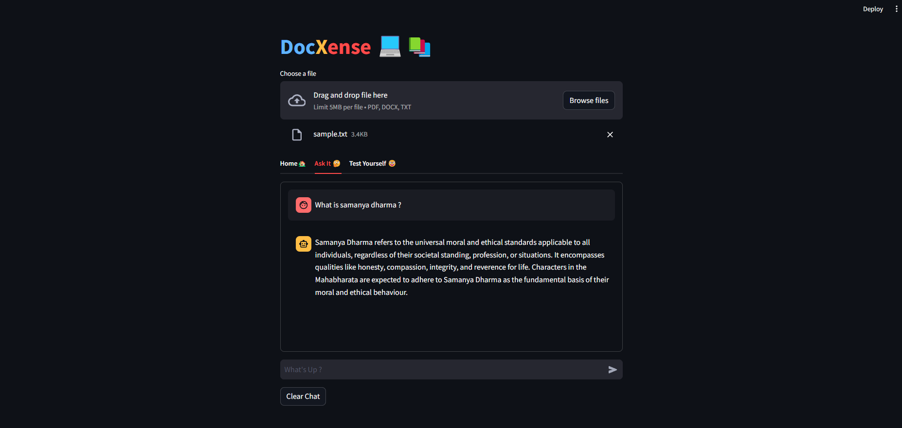
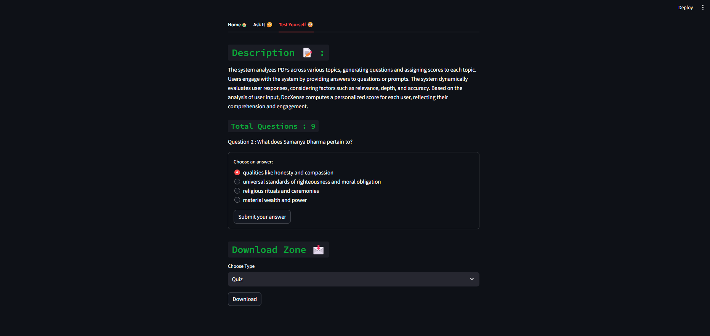
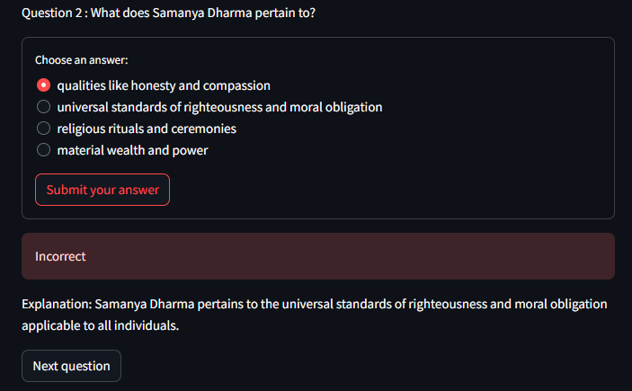
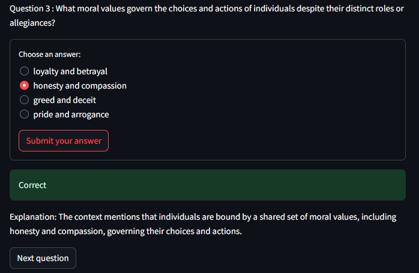

# DocXense : AI Study Helper


## ```Description 📝 :``` 
<b><span style="color:blue;">Doc</span><span style="color:orange;">X</span><span style="color:red;">ense</span></b>
is a versatile document analysis tool powered by advanced natural language processing. It offers two key functionalities: 

1. <b><span style="color:orange;">Question answering with RAG confidence indicators:</span></b> Users upload PDFs, ask questions, and receive responses with confidence ratings, enabling them to gauge the reliability of the answers. 

2.  <b><span style="color:orange;">Topic-based scoring:</span></b> The system analyzes PDFs across various topics, generating questions and assigning scores to each topic. Users engage with the system by providing answers to questions or prompts. The system dynamically evaluates user responses, considering factors such as relevance, depth, and accuracy. Based on the analysis of user input, DocXense computes a personalized score for each user, reflecting their comprehension and engagement.

With an intuitive interface and a focus on accuracy and efficiency, DocXense provides valuable insights from uploaded documents, catering to diverse user needs.

## ```Workflow Diagram 🌿 :```


## ```How to Use 😅 :```

1.  <b><span style="color:orange;">Access the Platform :</span></b> Open the platform and find the "Upload" button.
2. <b><span style="color:orange;">Upload Your Document : </span></b>  Select your document from your computer.
3. <b><span style="color:orange;">Wait for Upload :</span></b> Allow the document to finish uploading.
4. <b><span style="color:orange;">Choose Your Option : </span></b> Decide between asking questions or testing yourself.
    - <b><span style="color:skyblue;">Ask Questions : </span></b> Type your questions after the document has processed.
    - <b><span style="color:skyblue;">Test Yourself :  </span></b> Answer provided questions; the platform will score each topic.

## ```Setup ⚙️ :```
**1. Open src/.env and replace it with your HuggingFace API Token and OpenAI API Key.**
```env
HUGGINGFACEHUB_API_TOKEN=YOUR_API_KEY
OPENAI_API_KEY=YOUR_API_KEY
```
**2. Run the following command to download the requirements.**
```shell
pip install -r requirements.txt
```
**3. Once installed, run the following to startup the application.**
```shell
streamlit run src/main.py
```

## ```Screenshots 💻 :```




